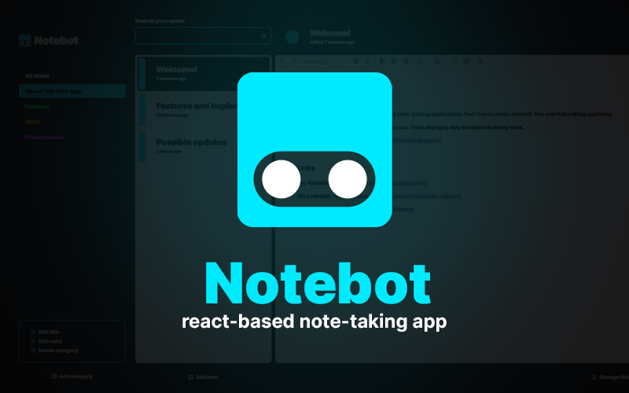

**Notebot** is a demo for a simple React note-taking single page application. It was built in 2021 and refactored/updated in late 2023.

Feel free to mess around! You aren't breaking anything. The demo is not intended for serious use, so your changes may be deleted at any time.

Notebot is currently hosted on Vercel, at [this link]().

# Features

- **Categories with colors**: Access, create, recolor, and rename categories. These serve as buckets for notes.

- **Notes with Rich Text**: Read, create, and recategorize notes. This is the point of the application! A rich text editor lets you do some formatting, like emphasis, font sizes, etc.

- **User Keys and Cloud Save**: When you first visit Notebot, a fresh user id is appended to the URL. All of your changes to categories, notes, and the app state are stored on the cloud. You may share this URL to let others see your notes. Refreshing the page should put you right back where you were before.

- **Filtering**: The user may filter their notes by keywords if they desire. Simple!

- **Timestamps**: Each note has a stored date for when it was last modified, which is how the notes list is sorted and provides functionality for the time ago tags.

# Technologies

*and why I chose them*

## Vite (build tool)

This app was originally built using create-react-app. It now uses **Vite**, an incredibly fast build tool. This was chosen due to its speed and versatility.

## React (front-end framework)

Ultra-popular front end framework, great for single state applications. I like Vue but chose **React** because it's more relevant to career and want to keep muscle memory going.

## SCSS (styles)

Styles written in SCSS in 2021 because it's super fast to do, it's embedded in my muscle memory. Would prefer to use Tailwind nowadays.

## Zustand & Jotai (state management)

Used to control state. Two **Zustand** stores manage categories and notes and associated actions, while UI state is managed by a couple of **Jotai** atoms.

I could say that Zustand and Jotai fulfill different roles: Zustand is a monolith kind of store designed for complex state, while Jotai is atomic and more like a global useState. While that's true and I use them as such, it's probably better to just stick to one or the other... I just wanted to learn and demo both at once.

## Mantine (RTE)

Originally wrote this app to use TinyMCE. Now that it's an obsolete solution, was causing some issues, and requires an API key to use, I switched to...

**Mantine** RTE (built over Tiptap headless RTE). Gives you finer and better module'd control over its features, and clearly built to support React unlike many other RTE solutions.

I would consider using Mantine for other components in the future.

## Firestore (noSQL cloud-based back-end)

Google Firebase Firestore is used to store all data produced by users, with a simple data structure sort of analogous to JSON.

It's simple, it's free (to a point), and it lets me focus on demoing a front end instead of maintaining both a front end and back end application. Probably not what I'd use for an enterprise application.

A firestore is built out of nested *collections*, which can be thought of as a dictionary of keys linked to sub-objects. This app has only one, *users*, and the rest are just objects stored within that user item.

```
COLLECTION
users: [
  [user]: {

    OBJECT
    categories: [
      [category]: {
        ...
      },
      ...
    ],

    OBJECT
    notes: [
      [note]: {

      },
      ...
    ]

    OBJECT
    states: {
      ...
    }
  }
]

```

## Vercel (cloud hosting)

**Vercel** is a modern cloud hosting solution meant for Next JS.

Well, it also does Vite and Astro, has a nice deployment dashboard, and does all that for free (to a certain point), so it's my go to for any projects.

# Future considerations

- Wouldn't be too difficult to add **real auth**: firebase makes it easy on the back end, and the front end is already structured in a way that would make it pretty easy. Just drop in an auth hook and done. Plus, would give me the chance to demo *routing*.

- Refactor SCSS into modules, or better yet, just turn it all into **tailwind**. Much easier to work with, and smaller file size because SCSS tends to use the same styles over and over.

- Refactor API to update individual items within collections, rather than syncing *all* categories and notes every time. This was not a priority because Firebase quota is filled by reads/writes rather than size of request, and the requests are fairly small anyway, but... it would be better to reflect a real world app.

# Running on local

To run the front end, just use

```
npm i
npm start
```

You won't be able to run the back end without a **.env file with Firebase keys**. 

As of writing, it's free to create and run your own Spark-level back end. Here's the template, just drop in the keys you get from there.

```
VITE_APIKEY=
VITE_AUTH_DOMAIN=
VITE_DATABASE_URL=
VITE_PROJECTID=
VITE_STORAGE_BUCKET=
VITE_MESSAGE_SENDER_ID=
VITE_APP_ID=
VITE_MEASUREMENT_ID=
```

## A few thoughts

## Refactor

This application was first developed around 2021 as a React experiment, then using...
- CRA (create-react-app)
- plain JavaScript.
- hooks to manage state with tons of prop drilling
- Github Pages to host

This application was refactored in late 2023...
- Vite (much faster and newer than CRA);
- TypeScript (super necessary for anything with data, which is like, everything?)
- Zustand and Jotai to manage state
- Totally new file structure, more granular components
- Vercel to host

## Philosophies

- API endpoints and services should be as granular, focused, and easy to understand as possible.

- Don't want too much middleware or it gets hard to navigate a large project. Hook, state, and API should generally be enough, though helper functions should always be seperated out into utils.

- Don't spend too much time trying to come up with clever logic. Clean architecture and readable code is far more important, and UI performance gains at this level are trivial. Might have different considerations with a larger project with more entries.